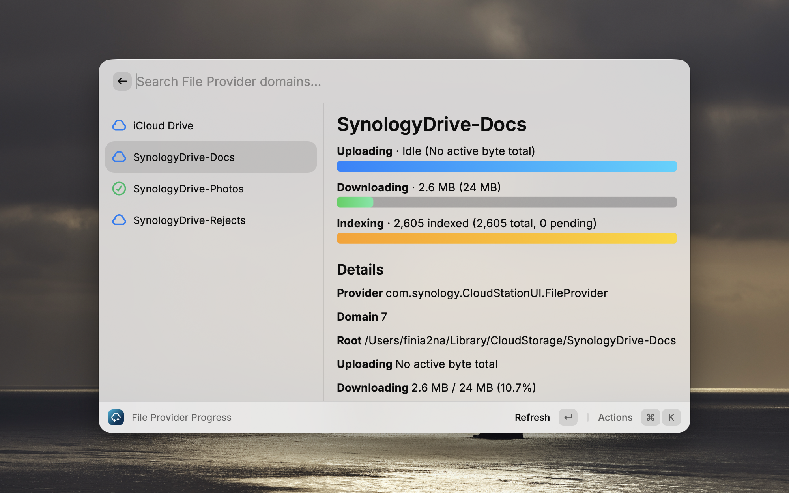

# File Provider Progress

Small macOS probe for File Provider sync progress. There is a CLI and a raycast frontend, a menu bar app is planned for later.



## Layout

```text
native/
  Package.swift
  Sources/FileProviderProgressCore/   Shared probe, parser, models, formatting
  Sources/fp-progress/                CLI frontend
  Tests/FileProviderProgressCoreTests/
raycast/
  package.json                        Raycast extension manifest and npm scripts
  src/                                Raycast TypeScript/React frontend
  assets/bin/                         Production-style bundled Swift CLI output
  metadata/                           Raycast Store screenshots
Makefile                             Root convenience commands
```

## Commands

Run from the repo root:

```sh
make build
make test
make list
make status
make status-json
make watch
make watch-json
make raycast-install
make raycast-dev
make raycast-build
```

`make watch` and `make watch-json` wait 10 seconds between completed polls by default. Override that wait time with:

```sh
make watch INTERVAL=30
make watch-json INTERVAL=30
```

Equivalent SwiftPM commands:

```sh
swift build --package-path native
swift test --package-path native
swift run --package-path native fp-progress status
swift run --package-path native fp-progress status --json
swift run --package-path native fp-progress watch --interval 30
```

## Raycast Development

Install the Raycast extension dependencies once:

```sh
make raycast-install
```

Then start Raycast development mode:

```sh
make raycast-dev
```

`make raycast-dev` builds the Swift debug CLI, copies it to `raycast/assets/bin/fp-progress`, and launches Raycast development mode. Search Raycast for `File Provider Progress` to open the command. The Raycast command fetches one status snapshot when opened and includes a manual Refresh action; it does not poll in the background.

For a production-style build:

```sh
make raycast-build
```

That target builds a universal Swift CLI in release mode, copies it to `raycast/assets/bin/fp-progress`, and runs Raycast's production build validation. The copied binary is generated from this repo and committed for Raycast Store distribution.

Useful Raycast checks:

```sh
make raycast-typecheck
make raycast-lint
make raycast-store-lint
```

`make raycast-lint` runs Raycast linting, broad ESLint checks, and TypeScript checks. `make raycast-store-lint` runs the strict Store validation path. Raycast's relaxed metadata lint is available inside `raycast/` as `npm run lint:raycast`.

## Output

`make list` shows discovered File Provider domains:

```text
SynologyDrive-Rejects
  id: com.synology.CloudStationUI.FileProvider/9
  root: /Users/example/Library/CloudStorage/SynologyDrive-Rejects
```

- `id`: provider/domain identifier passed to `fileproviderctl`.
- `root`: local File Provider root discovered through the `com.apple.file-provider-domain-id` extended attribute.

`make status` shows one current snapshot:

```text
SynologyDrive-Rejects
  Uploading: 64.66 GB / 65.45 GB (98.8%)
    Remaining: 793.2 MB (756.5 MB)
  Downloading: 54.3 MB / 499.6 MB (10.9%)
    Remaining: 445.3 MB (424.7 MB)
  Indexing: 0 pending / 9609 total
```

- `Uploading`: provider-reported current upload progress object, when byte totals are available.
- `Downloading`: provider-reported current download progress object, when byte totals are available.
- `Remaining`: `totalBytes - completedBytes`, shown in decimal and binary byte units.
- `Indexing`: File Provider indexing state, usually related to Spotlight/file metadata donation. This is not upload progress and does not mean files are waiting to sync. `pending` is the current indexable-item backlog; `total` is the total indexable count reported for that domain.
- `Health: active`: `fileproviderctl` indicated the domain was alive due to active File Provider work.
- `Health: needs sign-in`: macOS says the provider/domain needs authentication.

Some providers expose progress objects without byte totals. In that case the CLI prints:

```text
Uploading: no active byte total
```

That means the domain may still be healthy or active, but there is no usable byte count to summarize.

`make status-json` emits the same data as structured JSON for Raycast or other frontends:

```json
{
  "displayName": "SynologyDrive-Rejects",
  "providerId": "com.synology.CloudStationUI.FileProvider",
  "domainId": "9",
  "upload": {
    "completedBytes": 64525040327,
    "totalBytes": 65454841687,
    "remainingBytes": 929801360,
    "fraction": 0.9857947657341188
  }
}
```

`make watch` and `make watch-json` poll repeatedly. By default they wait 10 seconds after one poll completes before starting the next poll. `INTERVAL` and `--interval` set that wait-between-polls value, not a fixed start-to-start schedule. Watch mode can estimate speed and ETA from deltas between snapshots when progress is moving.

## Testing

Automated tests do not require active File Provider uploads. They use sample `fileproviderctl` dump text to verify parsing, normalized output, and speed/ETA calculation:

```sh
make test
```

Current test coverage checks:

- Upload and download byte totals are parsed from `Completed: X of Y`.
- Missing byte totals remain `nil` instead of being guessed.
- Health/indexing fields are parsed from dump output.
- Speed and ETA are computed from two snapshots.

Live commands such as `make status` depend on the current macOS machine state and may vary by provider, domain, sync activity, permissions, and macOS version.
